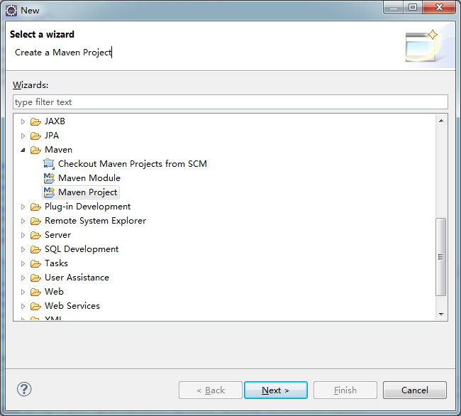
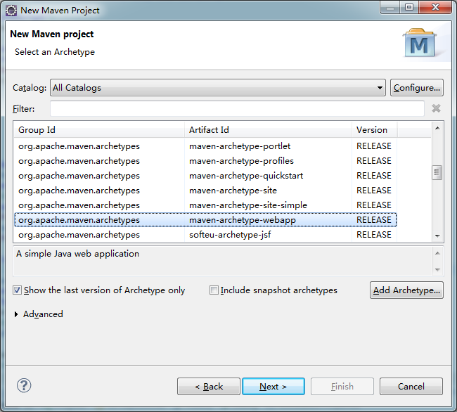
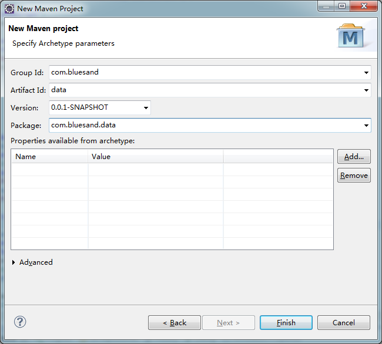

##maven构建springmvc3的eclipse工程
1. Eclipse下File -> New -> Ohter -> Maven -> Maven Project

2.  Next->New Maven Project

3. 填写Group Id, Artifact Id, Package ... -> Finish

4. 这样就构建基本的manve工程了，修改pom.xml增加springmvc3及其他的包

	* [pom.xml](codes/1.1/pom.xml)

5. 添加配置文件到 src/main/resource 目录下 (applicationContext.xml,jdbc.properties,log4j.properties,springmvc.xml,sql-map-config.xml,web.xml)
	* [applicationContext.xml](codes/1.1/applicationContext.xml)
	* [jdbc.properties](jdbc.properties)
	* [log4j.properties](codes/1.1/log4j.properties)
	* [springmvc.xml](codes/1.1/springmvc.xml)
	* [sql-map-config.xml](codes/1.1/sql-map-config.xml)
	* [web.xml](codes/1.1/web.xml)

